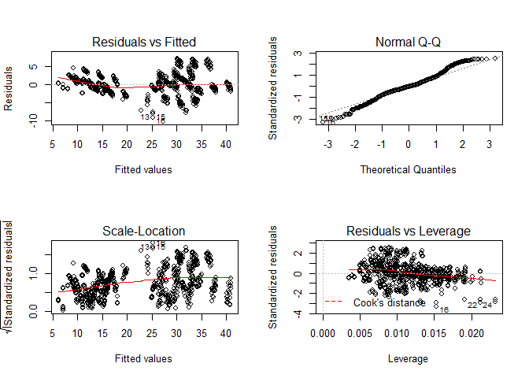

# Project:Energy Efficiency of Buildings
Pratap Timilsina  
December 17, 2016  


# Library


# Exploratory Analysis

```r
setwd("F:\\rockhurst\\02Applied Data Mining\\project\\Applied-Data-Mining")
House<-read.table("ecohome.csv",sep=",",head=T)


head(House)
```

```
##     X1    X2    X3     X4 X5 X6 X7 X8    Y1    Y2
## 1 0.98 514.5 294.0 110.25  7  2  0  0 15.55 21.33
## 2 0.98 514.5 294.0 110.25  7  3  0  0 15.55 21.33
## 3 0.98 514.5 294.0 110.25  7  4  0  0 15.55 21.33
## 4 0.98 514.5 294.0 110.25  7  5  0  0 15.55 21.33
## 5 0.90 563.5 318.5 122.50  7  2  0  0 20.84 28.28
## 6 0.90 563.5 318.5 122.50  7  3  0  0 21.46 25.38
```

```r
tail(House)
```

```
##       X1    X2    X3    X4  X5 X6  X7 X8    Y1    Y2
## 763 0.64 784.0 343.0 220.5 3.5  4 0.4  5 18.16 20.71
## 764 0.64 784.0 343.0 220.5 3.5  5 0.4  5 17.88 21.40
## 765 0.62 808.5 367.5 220.5 3.5  2 0.4  5 16.54 16.88
## 766 0.62 808.5 367.5 220.5 3.5  3 0.4  5 16.44 17.11
## 767 0.62 808.5 367.5 220.5 3.5  4 0.4  5 16.48 16.61
## 768 0.62 808.5 367.5 220.5 3.5  5 0.4  5 16.64 16.03
```

```r
View(House)
str(House)
```

```
## 'data.frame':	768 obs. of  10 variables:
##  $ X1: num  0.98 0.98 0.98 0.98 0.9 0.9 0.9 0.9 0.86 0.86 ...
##  $ X2: num  514 514 514 514 564 ...
##  $ X3: num  294 294 294 294 318 ...
##  $ X4: num  110 110 110 110 122 ...
##  $ X5: num  7 7 7 7 7 7 7 7 7 7 ...
##  $ X6: int  2 3 4 5 2 3 4 5 2 3 ...
##  $ X7: num  0 0 0 0 0 0 0 0 0 0 ...
##  $ X8: int  0 0 0 0 0 0 0 0 0 0 ...
##  $ Y1: num  15.6 15.6 15.6 15.6 20.8 ...
##  $ Y2: num  21.3 21.3 21.3 21.3 28.3 ...
```

```r
summary(House)
```

```
##        X1               X2              X3              X4       
##  Min.   :0.6200   Min.   :514.5   Min.   :245.0   Min.   :110.2  
##  1st Qu.:0.6825   1st Qu.:606.4   1st Qu.:294.0   1st Qu.:140.9  
##  Median :0.7500   Median :673.8   Median :318.5   Median :183.8  
##  Mean   :0.7642   Mean   :671.7   Mean   :318.5   Mean   :176.6  
##  3rd Qu.:0.8300   3rd Qu.:741.1   3rd Qu.:343.0   3rd Qu.:220.5  
##  Max.   :0.9800   Max.   :808.5   Max.   :416.5   Max.   :220.5  
##        X5             X6             X7               X8       
##  Min.   :3.50   Min.   :2.00   Min.   :0.0000   Min.   :0.000  
##  1st Qu.:3.50   1st Qu.:2.75   1st Qu.:0.1000   1st Qu.:1.750  
##  Median :5.25   Median :3.50   Median :0.2500   Median :3.000  
##  Mean   :5.25   Mean   :3.50   Mean   :0.2344   Mean   :2.812  
##  3rd Qu.:7.00   3rd Qu.:4.25   3rd Qu.:0.4000   3rd Qu.:4.000  
##  Max.   :7.00   Max.   :5.00   Max.   :0.4000   Max.   :5.000  
##        Y1              Y2       
##  Min.   : 6.01   Min.   :10.90  
##  1st Qu.:12.99   1st Qu.:15.62  
##  Median :18.95   Median :22.08  
##  Mean   :22.31   Mean   :24.59  
##  3rd Qu.:31.67   3rd Qu.:33.13  
##  Max.   :43.10   Max.   :48.03
```

```r
Relative.Compactness <- House$X1 
Surface.Area <-House$X2 
Wall.Area <-House$X3
Roof.Area <-House$X4 
Overall.Height <- House$X5
Orientation <-House$X6
Glazing.Area  <-House$X7
Glazing.Area.Distribution <-House$X8 
Heating.Load <- House$Y1
Cooling.Load <- House$Y2
```

We are able to see the summary statistics of 8 input parameters and 2 output efficiency parameters.


#Correlation

```r
cor(House)
```

```
##               X1            X2         X3            X4         X5
## X1  1.000000e+00 -9.919015e-01 -0.2037817 -8.688234e-01  0.8277473
## X2 -9.919015e-01  1.000000e+00  0.1955016  8.807195e-01 -0.8581477
## X3 -2.037817e-01  1.955016e-01  1.0000000 -2.923165e-01  0.2809757
## X4 -8.688234e-01  8.807195e-01 -0.2923165  1.000000e+00 -0.9725122
## X5  8.277473e-01 -8.581477e-01  0.2809757 -9.725122e-01  1.0000000
## X6  0.000000e+00  0.000000e+00  0.0000000  0.000000e+00  0.0000000
## X7  7.617400e-20  4.664140e-20  0.0000000 -1.197187e-19  0.0000000
## X8  0.000000e+00  0.000000e+00  0.0000000  0.000000e+00  0.0000000
## Y1  6.222722e-01 -6.581202e-01  0.4556712 -8.618283e-01  0.8894307
## Y2  6.343391e-01 -6.729989e-01  0.4271170 -8.625466e-01  0.8957852
##              X6            X7         X8           Y1          Y2
## X1  0.000000000  7.617400e-20 0.00000000  0.622272179  0.63433907
## X2  0.000000000  4.664140e-20 0.00000000 -0.658120227 -0.67299893
## X3  0.000000000  0.000000e+00 0.00000000  0.455671157  0.42711700
## X4  0.000000000 -1.197187e-19 0.00000000 -0.861828253 -0.86254660
## X5  0.000000000  0.000000e+00 0.00000000  0.889430674  0.89578517
## X6  1.000000000  0.000000e+00 0.00000000 -0.002586534  0.01428960
## X7  0.000000000  1.000000e+00 0.21296422  0.269840996  0.20750499
## X8  0.000000000  2.129642e-01 1.00000000  0.087367594  0.05052512
## Y1 -0.002586534  2.698410e-01 0.08736759  1.000000000  0.97586181
## Y2  0.014289598  2.075050e-01 0.05052512  0.975861813  1.00000000
```

```r
pairs(House)
```

<!-- -->

The correlation between two output parameters  is very high (i.e. 0.975).Hence by studying one of the output parameter, we can predict the value of other output parameter. So we have considered Heating Load  as the only output parameter.  Overall Height  variable has a very good correlation with the output parameter Heating Load (i.e. 0.889), hence we can say that Overall Height  is good  predictor of output parameter Heating Load.  Also  Relative Compactness  has a good correlation with the output parameter, so it is also a good predictor of output parameter.  The two predictor variables also have good correlation with each other. So the two predictor variable can themselves act as a good predictor-output pair and similarly we can see other relation.
The correlation table results were accounted in linear model.

#Distribution of input parameters and output parameters

```r
par(mfrow=c(2,2))
hist(Relative.Compactness,col = "blue1")
hist(Surface.Area,col = "blue1")
hist(Wall.Area,col = "blue1") 
hist(Roof.Area,col = "blue1")
```

<!-- -->

```r
par(mfrow=c(2,2))
hist(Overall.Height,col = "blue1") 
hist(Orientation,col = "blue1") 
hist(Glazing.Area ,col = "blue1") 
hist(Glazing.Area.Distribution ,col = "blue1")
```

<!-- -->

```r
par(mfrow=c(2,1))
hist(Heating.Load,col = "blue1") 
hist(Cooling.Load,col = "blue1" )
```

<!-- -->

```r
House<-House[-10]
```


#Linear Model 1 with all Predictors

```r
House<-House[-10]
lm.mo1<-lm(Heating.Load~Relative.Compactness+Surface.Area+Wall.Area+Roof.Area+Overall.Height+Orientation
+Glazing.Area+Glazing.Area.Distribution,data=House)
summary(lm.mo1)
```

```
## 
## Call:
## lm(formula = Heating.Load ~ Relative.Compactness + Surface.Area + 
##     Wall.Area + Roof.Area + Overall.Height + Orientation + Glazing.Area + 
##     Glazing.Area.Distribution, data = House)
## 
## Residuals:
##     Min      1Q  Median      3Q     Max 
## -9.8965 -1.3196 -0.0252  1.3532  7.7052 
## 
## Coefficients: (1 not defined because of singularities)
##                             Estimate Std. Error t value Pr(>|t|)    
## (Intercept)                84.014521  19.033607   4.414 1.16e-05 ***
## Relative.Compactness      -64.773991  10.289445  -6.295 5.19e-10 ***
## Surface.Area               -0.087290   0.017075  -5.112 4.04e-07 ***
## Wall.Area                   0.060813   0.006648   9.148  < 2e-16 ***
## Roof.Area                         NA         NA      NA       NA    
## Overall.Height              4.169939   0.337990  12.337  < 2e-16 ***
## Orientation                -0.023328   0.094705  -0.246  0.80550    
## Glazing.Area               19.932680   0.813986  24.488  < 2e-16 ***
## Glazing.Area.Distribution   0.203772   0.069918   2.914  0.00367 ** 
## ---
## Signif. codes:  0 '***' 0.001 '**' 0.01 '*' 0.05 '.' 0.1 ' ' 1
## 
## Residual standard error: 2.934 on 760 degrees of freedom
## Multiple R-squared:  0.9162,	Adjusted R-squared:  0.9154 
## F-statistic:  1187 on 7 and 760 DF,  p-value: < 2.2e-16
```

####When comparing models fitted by maximum likelihood to the same data, the smaller the AIC or BIC, the better the fit.

#Akaike Information Criterion (AIC)

```r
step (lm.mo1, direction="backward")
```

```
## Start:  AIC=1661.42
## Heating.Load ~ Relative.Compactness + Surface.Area + Wall.Area + 
##     Roof.Area + Overall.Height + Orientation + Glazing.Area + 
##     Glazing.Area.Distribution
## 
## 
## Step:  AIC=1661.42
## Heating.Load ~ Relative.Compactness + Surface.Area + Wall.Area + 
##     Overall.Height + Orientation + Glazing.Area + Glazing.Area.Distribution
## 
##                             Df Sum of Sq     RSS    AIC
## - Orientation                1       0.5  6544.3 1659.5
## <none>                                    6543.8 1661.4
## - Glazing.Area.Distribution  1      73.1  6616.9 1668.0
## - Surface.Area               1     225.0  6768.8 1685.4
## - Relative.Compactness       1     341.2  6885.0 1698.5
## - Wall.Area                  1     720.5  7264.3 1739.7
## - Overall.Height             1    1310.6  7854.4 1799.6
## - Glazing.Area               1    5163.1 11706.9 2106.1
## 
## Step:  AIC=1659.48
## Heating.Load ~ Relative.Compactness + Surface.Area + Wall.Area + 
##     Overall.Height + Glazing.Area + Glazing.Area.Distribution
## 
##                             Df Sum of Sq     RSS    AIC
## <none>                                    6544.3 1659.5
## - Glazing.Area.Distribution  1      73.1  6617.4 1666.0
## - Surface.Area               1     225.0  6769.3 1683.5
## - Relative.Compactness       1     341.2  6885.5 1696.5
## - Wall.Area                  1     720.5  7264.8 1737.7
## - Overall.Height             1    1310.6  7854.9 1797.7
## - Glazing.Area               1    5163.1 11707.4 2104.2
```

```
## 
## Call:
## lm(formula = Heating.Load ~ Relative.Compactness + Surface.Area + 
##     Wall.Area + Overall.Height + Glazing.Area + Glazing.Area.Distribution, 
##     data = House)
## 
## Coefficients:
##               (Intercept)       Relative.Compactness  
##                  83.93287                  -64.77399  
##              Surface.Area                  Wall.Area  
##                  -0.08729                    0.06081  
##            Overall.Height               Glazing.Area  
##                   4.16994                   19.93268  
## Glazing.Area.Distribution  
##                   0.20377
```

####After removing Roof Area the AIC remains unchanged. This happens due to the fact that Roof Area does not play a part in determining the response variable but after removing Orientation the model improves as AIC changes. We can see that attributes like Relative Compactness, Surface Area, Wall Area, Overall Height, Glazing Area and Glazing Area Distribution play a significant part in deciding the value of response variable.

#Bayesian Information Criterion (BIC)

```r
step(lm.mo1,direction="backward",k=log(nrow(House)))
```

```
## Start:  AIC=1698.57
## Heating.Load ~ Relative.Compactness + Surface.Area + Wall.Area + 
##     Roof.Area + Overall.Height + Orientation + Glazing.Area + 
##     Glazing.Area.Distribution
## 
## 
## Step:  AIC=1698.57
## Heating.Load ~ Relative.Compactness + Surface.Area + Wall.Area + 
##     Overall.Height + Orientation + Glazing.Area + Glazing.Area.Distribution
## 
##                             Df Sum of Sq     RSS    AIC
## - Orientation                1       0.5  6544.3 1692.0
## <none>                                    6543.8 1698.6
## - Glazing.Area.Distribution  1      73.1  6616.9 1700.5
## - Surface.Area               1     225.0  6768.8 1717.9
## - Relative.Compactness       1     341.2  6885.0 1731.0
## - Wall.Area                  1     720.5  7264.3 1772.2
## - Overall.Height             1    1310.6  7854.4 1832.1
## - Glazing.Area               1    5163.1 11706.9 2138.7
## 
## Step:  AIC=1691.99
## Heating.Load ~ Relative.Compactness + Surface.Area + Wall.Area + 
##     Overall.Height + Glazing.Area + Glazing.Area.Distribution
## 
##                             Df Sum of Sq     RSS    AIC
## <none>                                    6544.3 1692.0
## - Glazing.Area.Distribution  1      73.1  6617.4 1693.9
## - Surface.Area               1     225.0  6769.3 1711.3
## - Relative.Compactness       1     341.2  6885.5 1724.4
## - Wall.Area                  1     720.5  7264.8 1765.6
## - Overall.Height             1    1310.6  7854.9 1825.5
## - Glazing.Area               1    5163.1 11707.4 2132.0
```

```
## 
## Call:
## lm(formula = Heating.Load ~ Relative.Compactness + Surface.Area + 
##     Wall.Area + Overall.Height + Glazing.Area + Glazing.Area.Distribution, 
##     data = House)
## 
## Coefficients:
##               (Intercept)       Relative.Compactness  
##                  83.93287                  -64.77399  
##              Surface.Area                  Wall.Area  
##                  -0.08729                    0.06081  
##            Overall.Height               Glazing.Area  
##                   4.16994                   19.93268  
## Glazing.Area.Distribution  
##                   0.20377
```

####The behavior of BIC is similar to AIC.BIC  remains unchanged after removal of Roof Area since it is not significant in determining the value of response variable. The model improves after the removal of Orientation. Thus AIC and BIC give similar outputs and the significant variables remain the same for both.


### Examine the Residuals
####The residual for the final model is discussed later on. Residual plots is plotted for each model so as to compare how it changes.


```r
par(mfrow=c(2,2))
plot(lm.mo1)
```

<!-- -->

#Linear Model with interaction between predictors
##Linear Model 2 
The interactin term Relative.Compactness:Overall.Height added to linear model 1.
We added interaction terms by seeing the correlation matrix.


```r
lm.mo2<-lm(Heating.Load~Relative.Compactness+Surface.Area+Wall.Area+Roof.Area+Overall.Height+Orientation
+Glazing.Area+Glazing.Area.Distribution+Relative.Compactness:Overall.Height,data=House)
summary(lm.mo2)
```

```
## 
## Call:
## lm(formula = Heating.Load ~ Relative.Compactness + Surface.Area + 
##     Wall.Area + Roof.Area + Overall.Height + Orientation + Glazing.Area + 
##     Glazing.Area.Distribution + Relative.Compactness:Overall.Height, 
##     data = House)
## 
## Residuals:
##     Min      1Q  Median      3Q     Max 
## -9.1558 -1.4492 -0.1067  1.5843  7.0030 
## 
## Coefficients: (1 not defined because of singularities)
##                                       Estimate Std. Error t value Pr(>|t|)
## (Intercept)                         -526.89163   74.76604  -7.047 4.10e-12
## Relative.Compactness                 412.38074   57.48702   7.173 1.74e-12
## Surface.Area                           0.28924    0.04759   6.078 1.92e-09
## Wall.Area                              0.02609    0.00758   3.441 0.000611
## Roof.Area                                   NA         NA      NA       NA
## Overall.Height                        32.90615    3.42624   9.604  < 2e-16
## Orientation                           -0.02333    0.09062  -0.257 0.796928
## Glazing.Area                          19.93268    0.77892  25.590  < 2e-16
## Glazing.Area.Distribution              0.20377    0.06691   3.046 0.002402
## Relative.Compactness:Overall.Height  -35.15980    4.17341  -8.425  < 2e-16
##                                        
## (Intercept)                         ***
## Relative.Compactness                ***
## Surface.Area                        ***
## Wall.Area                           ***
## Roof.Area                              
## Overall.Height                      ***
## Orientation                            
## Glazing.Area                        ***
## Glazing.Area.Distribution           ** 
## Relative.Compactness:Overall.Height ***
## ---
## Signif. codes:  0 '***' 0.001 '**' 0.01 '*' 0.05 '.' 0.1 ' ' 1
## 
## Residual standard error: 2.808 on 759 degrees of freedom
## Multiple R-squared:  0.9234,	Adjusted R-squared:  0.9226 
## F-statistic:  1143 on 8 and 759 DF,  p-value: < 2.2e-16
```


### Examine the Residuals


```r
par(mfrow=c(2,2))
plot(lm.mo2)
```

<!-- -->

##Linear Model 3
The interactin term Glazing.Area.Distribution:Overall.Height added to linear model 2


```r
lm.mo3<-lm(Heating.Load~Relative.Compactness+Surface.Area+Wall.Area+Roof.Area+Overall.Height+Orientation
+Glazing.Area+Glazing.Area.Distribution+Relative.Compactness:Overall.Height+Glazing.Area.Distribution:Overall.Height,data=House)
summary(lm.mo3)
```

```
## 
## Call:
## lm(formula = Heating.Load ~ Relative.Compactness + Surface.Area + 
##     Wall.Area + Roof.Area + Overall.Height + Orientation + Glazing.Area + 
##     Glazing.Area.Distribution + Relative.Compactness:Overall.Height + 
##     Glazing.Area.Distribution:Overall.Height, data = House)
## 
## Residuals:
##     Min      1Q  Median      3Q     Max 
## -8.6131 -1.5298 -0.1627  1.6371  7.3527 
## 
## Coefficients: (1 not defined because of singularities)
##                                            Estimate Std. Error t value
## (Intercept)                              -5.253e+02  7.439e+01  -7.061
## Relative.Compactness                      4.124e+02  5.719e+01   7.210
## Surface.Area                              2.892e-01  4.734e-02   6.109
## Wall.Area                                 2.609e-02  7.542e-03   3.459
## Roof.Area                                        NA         NA      NA
## Overall.Height                            3.260e+01  3.410e+00   9.558
## Orientation                              -2.333e-02  9.016e-02  -0.259
## Glazing.Area                              1.993e+01  7.749e-01  25.721
## Glazing.Area.Distribution                -3.751e-01  2.062e-01  -1.820
## Relative.Compactness:Overall.Height      -3.516e+01  4.152e+00  -8.468
## Overall.Height:Glazing.Area.Distribution  1.103e-01  3.716e-02   2.967
##                                          Pr(>|t|)    
## (Intercept)                              3.74e-12 ***
## Relative.Compactness                     1.35e-12 ***
## Surface.Area                             1.60e-09 ***
## Wall.Area                                0.000573 ***
## Roof.Area                                      NA    
## Overall.Height                            < 2e-16 ***
## Orientation                              0.795910    
## Glazing.Area                              < 2e-16 ***
## Glazing.Area.Distribution                0.069210 .  
## Relative.Compactness:Overall.Height       < 2e-16 ***
## Overall.Height:Glazing.Area.Distribution 0.003102 ** 
## ---
## Signif. codes:  0 '***' 0.001 '**' 0.01 '*' 0.05 '.' 0.1 ' ' 1
## 
## Residual standard error: 2.794 on 758 degrees of freedom
## Multiple R-squared:  0.9242,	Adjusted R-squared:  0.9233 
## F-statistic:  1028 on 9 and 758 DF,  p-value: < 2.2e-16
```


### Examine the Residuals


```r
par(mfrow=c(2,2))
plot(lm.mo3)
```

<!-- -->

##Linear Model 4
The interactin term Surface.Area:Roof added to linear model 3


```r
lm.mo4<-lm(Heating.Load~Relative.Compactness+Surface.Area+Wall.Area+Roof.Area+Overall.Height+Orientation
+Glazing.Area+Glazing.Area.Distribution+Relative.Compactness:Overall.Height+Glazing.Area.Distribution:Overall.Height+Surface.Area:Roof.Area,data=House)
summary(lm.mo4)
```

```
## 
## Call:
## lm(formula = Heating.Load ~ Relative.Compactness + Surface.Area + 
##     Wall.Area + Roof.Area + Overall.Height + Orientation + Glazing.Area + 
##     Glazing.Area.Distribution + Relative.Compactness:Overall.Height + 
##     Glazing.Area.Distribution:Overall.Height + Surface.Area:Roof.Area, 
##     data = House)
## 
## Residuals:
##     Min      1Q  Median      3Q     Max 
## -9.1420 -1.3938  0.0613  1.7028  6.4285 
## 
## Coefficients: (1 not defined because of singularities)
##                                            Estimate Std. Error t value
## (Intercept)                              -3.548e+02  8.021e+01  -4.424
## Relative.Compactness                      5.093e+02  5.927e+01   8.592
## Surface.Area                             -6.546e-01  1.880e-01  -3.481
## Wall.Area                                 5.681e-01  1.049e-01   5.416
## Roof.Area                                        NA         NA      NA
## Overall.Height                            5.927e+01  6.145e+00   9.645
## Orientation                              -2.333e-02  8.866e-02  -0.263
## Glazing.Area                              1.993e+01  7.621e-01  26.156
## Glazing.Area.Distribution                -3.751e-01  2.027e-01  -1.850
## Relative.Compactness:Overall.Height      -6.785e+01  7.516e+00  -9.027
## Overall.Height:Glazing.Area.Distribution  1.103e-01  3.655e-02   3.017
## Surface.Area:Roof.Area                    1.744e-03  3.366e-04   5.181
##                                          Pr(>|t|)    
## (Intercept)                              1.11e-05 ***
## Relative.Compactness                      < 2e-16 ***
## Surface.Area                             0.000528 ***
## Wall.Area                                8.18e-08 ***
## Roof.Area                                      NA    
## Overall.Height                            < 2e-16 ***
## Orientation                              0.792539    
## Glazing.Area                              < 2e-16 ***
## Glazing.Area.Distribution                0.064648 .  
## Relative.Compactness:Overall.Height       < 2e-16 ***
## Overall.Height:Glazing.Area.Distribution 0.002637 ** 
## Surface.Area:Roof.Area                   2.84e-07 ***
## ---
## Signif. codes:  0 '***' 0.001 '**' 0.01 '*' 0.05 '.' 0.1 ' ' 1
## 
## Residual standard error: 2.747 on 757 degrees of freedom
## Multiple R-squared:  0.9268,	Adjusted R-squared:  0.9259 
## F-statistic:   959 on 10 and 757 DF,  p-value: < 2.2e-16
```


### Examine the Residuals


```r
par(mfrow=c(2,2))
plot(lm.mo4)
```

<!-- -->


##Linear Model 5
The interactin term Wall.Area:Overall.Height added to linear model 4


```r
lm.mo5<-lm(Heating.Load~Relative.Compactness+Surface.Area+Wall.Area+Roof.Area+Overall.Height+Orientation
+Glazing.Area+Glazing.Area.Distribution+Relative.Compactness:Overall.Height+Glazing.Area.Distribution:Overall.Height+Surface.Area:Roof.Area+Wall.Area:Overall.Height,data=House)
summary(lm.mo5)
```

```
## 
## Call:
## lm(formula = Heating.Load ~ Relative.Compactness + Surface.Area + 
##     Wall.Area + Roof.Area + Overall.Height + Orientation + Glazing.Area + 
##     Glazing.Area.Distribution + Relative.Compactness:Overall.Height + 
##     Glazing.Area.Distribution:Overall.Height + Surface.Area:Roof.Area + 
##     Wall.Area:Overall.Height, data = House)
## 
## Residuals:
##     Min      1Q  Median      3Q     Max 
## -8.2842 -1.5901 -0.3716  1.2296  7.3833 
## 
## Coefficients: (1 not defined because of singularities)
##                                            Estimate Std. Error t value
## (Intercept)                               3.397e+02  8.644e+01   3.930
## Relative.Compactness                     -8.004e+02  1.062e+02  -7.540
## Surface.Area                              9.327e-01  2.010e-01   4.640
## Wall.Area                                -2.459e+00  2.325e-01 -10.576
## Roof.Area                                        NA         NA      NA
## Overall.Height                           -2.476e+02  2.227e+01 -11.116
## Orientation                              -2.333e-02  7.882e-02  -0.296
## Glazing.Area                              1.993e+01  6.774e-01  29.424
## Glazing.Area.Distribution                -3.751e-01  1.802e-01  -2.082
## Relative.Compactness:Overall.Height       2.327e+02  2.218e+01  10.493
## Overall.Height:Glazing.Area.Distribution  1.103e-01  3.249e-02   3.394
## Surface.Area:Roof.Area                    1.038e-03  3.033e-04   3.421
## Wall.Area:Overall.Height                  3.834e-01  2.698e-02  14.212
##                                          Pr(>|t|)    
## (Intercept)                              9.27e-05 ***
## Relative.Compactness                     1.35e-13 ***
## Surface.Area                             4.11e-06 ***
## Wall.Area                                 < 2e-16 ***
## Roof.Area                                      NA    
## Overall.Height                            < 2e-16 ***
## Orientation                              0.767327    
## Glazing.Area                              < 2e-16 ***
## Glazing.Area.Distribution                0.037718 *  
## Relative.Compactness:Overall.Height       < 2e-16 ***
## Overall.Height:Glazing.Area.Distribution 0.000724 ***
## Surface.Area:Roof.Area                   0.000657 ***
## Wall.Area:Overall.Height                  < 2e-16 ***
## ---
## Signif. codes:  0 '***' 0.001 '**' 0.01 '*' 0.05 '.' 0.1 ' ' 1
## 
## Residual standard error: 2.442 on 756 degrees of freedom
## Multiple R-squared:  0.9423,	Adjusted R-squared:  0.9414 
## F-statistic:  1122 on 11 and 756 DF,  p-value: < 2.2e-16
```


### Examine the Residuals


```r
par(mfrow=c(2,2))
plot(lm.mo5)
```

<!-- -->


##Linear Model 6


```r
lm.mo6<-lm(Heating.Load~Relative.Compactness+Surface.Area+Wall.Area+Roof.Area+Overall.Height+Orientation
+Glazing.Area+Glazing.Area.Distribution+Relative.Compactness:Overall.Height+Glazing.Area.Distribution:Overall.Height+Surface.Area:Roof.Area+Wall.Area:Overall.Height+Glazing.Area:Glazing.Area.Distribution,data=House)
summary(lm.mo6)
```

```
## 
## Call:
## lm(formula = Heating.Load ~ Relative.Compactness + Surface.Area + 
##     Wall.Area + Roof.Area + Overall.Height + Orientation + Glazing.Area + 
##     Glazing.Area.Distribution + Relative.Compactness:Overall.Height + 
##     Glazing.Area.Distribution:Overall.Height + Surface.Area:Roof.Area + 
##     Wall.Area:Overall.Height + Glazing.Area:Glazing.Area.Distribution, 
##     data = House)
## 
## Residuals:
##     Min      1Q  Median      3Q     Max 
## -6.9800 -1.3912 -0.3392  1.1866  6.3950 
## 
## Coefficients: (1 not defined because of singularities)
##                                            Estimate Std. Error t value
## (Intercept)                               3.384e+02  8.346e+01   4.055
## Relative.Compactness                     -8.004e+02  1.025e+02  -7.809
## Surface.Area                              9.327e-01  1.941e-01   4.805
## Wall.Area                                -2.459e+00  2.245e-01 -10.953
## Roof.Area                                        NA         NA      NA
## Overall.Height                           -2.476e+02  2.150e+01 -11.513
## Orientation                              -2.333e-02  7.610e-02  -0.307
## Glazing.Area                              2.706e+01  1.156e+00  23.406
## Glazing.Area.Distribution                 2.093e-01  1.908e-01   1.097
## Relative.Compactness:Overall.Height       2.327e+02  2.142e+01  10.867
## Overall.Height:Glazing.Area.Distribution  1.103e-01  3.137e-02   3.515
## Surface.Area:Roof.Area                    1.038e-03  2.929e-04   3.543
## Wall.Area:Overall.Height                  3.834e-01  2.605e-02  14.719
## Glazing.Area:Glazing.Area.Distribution   -2.860e+00  3.824e-01  -7.478
##                                          Pr(>|t|)    
## (Intercept)                              5.54e-05 ***
## Relative.Compactness                     1.92e-14 ***
## Surface.Area                             1.87e-06 ***
## Wall.Area                                 < 2e-16 ***
## Roof.Area                                      NA    
## Overall.Height                            < 2e-16 ***
## Orientation                              0.759277    
## Glazing.Area                              < 2e-16 ***
## Glazing.Area.Distribution                0.272786    
## Relative.Compactness:Overall.Height       < 2e-16 ***
## Overall.Height:Glazing.Area.Distribution 0.000466 ***
## Surface.Area:Roof.Area                   0.000419 ***
## Wall.Area:Overall.Height                  < 2e-16 ***
## Glazing.Area:Glazing.Area.Distribution   2.10e-13 ***
## ---
## Signif. codes:  0 '***' 0.001 '**' 0.01 '*' 0.05 '.' 0.1 ' ' 1
## 
## Residual standard error: 2.358 on 755 degrees of freedom
## Multiple R-squared:  0.9462,	Adjusted R-squared:  0.9454 
## F-statistic:  1108 on 12 and 755 DF,  p-value: < 2.2e-16
```

The R-squared value increases gradually from model1 to model6 indicating the performance of the model improved.

### Examine the Residuals


```r
par(mfrow=c(2,2))
plot(lm.mo6)
```

<!-- -->


####The Residuals v/s Fitted values graph shows that the variables are scattered on the both side of the reference line. Also there is a very high variance in the values. This is due to the fact that most variables have few distinct values because of which the values in graph are scattered. Also the graph appears to be fanning out to the right. Hence the model is not a good fit for the data. The normal Q-Q graph is not linear, it is off at the ends of diagonal.


####	Are lm.mo and lm.mo5 significantly different? 

```r
anova(lm.mo1,lm.mo6)
```

```
## Analysis of Variance Table
## 
## Model 1: Heating.Load ~ Relative.Compactness + Surface.Area + Wall.Area + 
##     Roof.Area + Overall.Height + Orientation + Glazing.Area + 
##     Glazing.Area.Distribution
## Model 2: Heating.Load ~ Relative.Compactness + Surface.Area + Wall.Area + 
##     Roof.Area + Overall.Height + Orientation + Glazing.Area + 
##     Glazing.Area.Distribution + Relative.Compactness:Overall.Height + 
##     Glazing.Area.Distribution:Overall.Height + Surface.Area:Roof.Area + 
##     Wall.Area:Overall.Height + Glazing.Area:Glazing.Area.Distribution
##   Res.Df    RSS Df Sum of Sq    F    Pr(>F)    
## 1    760 6543.8                                
## 2    755 4197.6  5    2346.2 84.4 < 2.2e-16 ***
## ---
## Signif. codes:  0 '***' 0.001 '**' 0.01 '*' 0.05 '.' 0.1 ' ' 1
```

#####The p-value of anova test <0.05 indicates that lm.mo6 is better that lm.mo1  ie lm.mo6 has statistically significant difference.


##Durbin Watson Test


```r
library(car)
durbinWatsonTest(lm.mo1)
```

```
##  lag Autocorrelation D-W Statistic p-value
##    1       0.6689005     0.6535771       0
##  Alternative hypothesis: rho != 0
```

```r
durbinWatsonTest(lm.mo2)
```

```
##  lag Autocorrelation D-W Statistic p-value
##    1       0.6768845     0.6355385       0
##  Alternative hypothesis: rho != 0
```

```r
durbinWatsonTest(lm.mo3)
```

```
##  lag Autocorrelation D-W Statistic p-value
##    1       0.6746997     0.6415139       0
##  Alternative hypothesis: rho != 0
```

```r
durbinWatsonTest(lm.mo4)
```

```
##  lag Autocorrelation D-W Statistic p-value
##    1        0.675752     0.6378421       0
##  Alternative hypothesis: rho != 0
```

```r
durbinWatsonTest(lm.mo5)
```

```
##  lag Autocorrelation D-W Statistic p-value
##    1       0.6953946     0.5931859       0
##  Alternative hypothesis: rho != 0
```

```r
durbinWatsonTest(lm.mo6)
```

```
##  lag Autocorrelation D-W Statistic p-value
##    1       0.6742831     0.6397252       0
##  Alternative hypothesis: rho != 0
```

```r
#0<DW<2 implies autocorrelation in error terms
#DW=2 implies there is no autocorrelation in error terms
```

#####D-W Statistic = 0.6397252 , there is autocorrelation in error terms telling about we need to improve accuracy of model.


##Non-constant Variance Score Test


```r
ncvTest(lm.mo1)
```

```
## Non-constant Variance Score Test 
## Variance formula: ~ fitted.values 
## Chisquare = 168.467    Df = 1     p = 1.599527e-38
```

```r
ncvTest(lm.mo2)
```

```
## Non-constant Variance Score Test 
## Variance formula: ~ fitted.values 
## Chisquare = 125.5192    Df = 1     p = 3.917827e-29
```

```r
ncvTest(lm.mo3)
```

```
## Non-constant Variance Score Test 
## Variance formula: ~ fitted.values 
## Chisquare = 129.3991    Df = 1     p = 5.546675e-30
```

```r
ncvTest(lm.mo4)
```

```
## Non-constant Variance Score Test 
## Variance formula: ~ fitted.values 
## Chisquare = 127.4922    Df = 1     p = 1.449665e-29
```

```r
ncvTest(lm.mo5)
```

```
## Non-constant Variance Score Test 
## Variance formula: ~ fitted.values 
## Chisquare = 66.69368    Df = 1     p = 3.171498e-16
```

```r
ncvTest(lm.mo6)
```

```
## Non-constant Variance Score Test 
## Variance formula: ~ fitted.values 
## Chisquare = 77.27011    Df = 1     p = 1.491052e-18
```

#####The p-Value<0.05 for Non-constant Variance Score Test indicates heteroskedasticity meaning the probability distribution of the errors don't have constant variance. T


# Validation approach using 70-30 split

```r
splitdf <- function(dataframe, seed=NULL,percent_train=NULL) {
  if (!is.null(seed)) set.seed(seed)
  index <- 1:nrow(dataframe)
  trainindex <- sample(index, trunc(length(index)*percent_train/100))
  trainset <- dataframe[trainindex, ]
  testset <- dataframe[-trainindex, ]
  list(trainset=trainset,testset=testset)}
#apply the function
splits <- splitdf(House, seed=808,percent_train=70)
 

# save the training and testing sets as data frames
House_train <- splits$trainset
House_test <- splits$testset
dim(House_train) #checking the split
```

```
## [1] 537   9
```

```r
dim(House_test) #checking the split
```

```
## [1] 231   9
```


# Tree

```r
library(partykit)
library(party)
library(rminer)
```

```
## Warning: package 'rminer' was built under R version 3.2.5
```

```
## 
## Attaching package: 'rminer'
```

```
## The following object is masked from 'package:party':
## 
##     fit
```

```
## The following object is masked from 'package:modeltools':
## 
##     fit
```

```r
House.ctree<-ctree(House_train$Y1~.,  data=House_train)
House.ctree
```

```
## 
## 	 Conditional inference tree with 33 terminal nodes
## 
## Response:  House_train$Y1 
## Inputs:  X1, X2, X3, X4, X5, X6, X7, X8 
## Number of observations:  537 
## 
## 1) X5 <= 3.5; criterion = 1, statistic = 421.767
##   2) X7 <= 0.1; criterion = 1, statistic = 142.646
##     3) X7 <= 0; criterion = 1, statistic = 55.58
##       4)*  weights = 17 
##     3) X7 > 0
##       5) X1 <= 0.64; criterion = 1, statistic = 49.867
##         6) X1 <= 0.62; criterion = 1, statistic = 31.64
##           7)*  weights = 18 
##         6) X1 > 0.62
##           8)*  weights = 15 
##       5) X1 > 0.64
##         9) X1 <= 0.71; criterion = 1, statistic = 27.855
##           10)*  weights = 41 
##         9) X1 > 0.71
##           11)*  weights = 15 
##   2) X7 > 0.1
##     12) X2 <= 759.5; criterion = 1, statistic = 74.322
##       13) X7 <= 0.25; criterion = 1, statistic = 87.945
##         14) X2 <= 710.5; criterion = 1, statistic = 35.189
##           15) X8 <= 1; criterion = 0.986, statistic = 9.84
##             16)*  weights = 8 
##           15) X8 > 1
##             17)*  weights = 23 
##         14) X2 > 710.5
##           18) X2 <= 735; criterion = 0.982, statistic = 9.286
##             19)*  weights = 14 
##           18) X2 > 735
##             20)*  weights = 13 
##       13) X7 > 0.25
##         21) X3 <= 294; criterion = 0.998, statistic = 13.085
##           22) X8 <= 4; criterion = 0.981, statistic = 9.208
##             23)*  weights = 31 
##           22) X8 > 4
##             24)*  weights = 10 
##         21) X3 > 294
##           25)*  weights = 12 
##     12) X2 > 759.5
##       26) X1 <= 0.62; criterion = 1, statistic = 29.246
##         27) X7 <= 0.25; criterion = 1, statistic = 20.272
##           28)*  weights = 12 
##         27) X7 > 0.25
##           29)*  weights = 14 
##       26) X1 > 0.62
##         30) X7 <= 0.25; criterion = 1, statistic = 24.5
##           31)*  weights = 14 
##         30) X7 > 0.25
##           32)*  weights = 17 
## 1) X5 > 3.5
##   33) X7 <= 0.1; criterion = 1, statistic = 88.625
##     34) X2 <= 612.5; criterion = 1, statistic = 29.17
##       35) X7 <= 0; criterion = 1, statistic = 41.941
##         36)*  weights = 13 
##       35) X7 > 0
##         37)*  weights = 50 
##     34) X2 > 612.5
##       38) X7 <= 0; criterion = 1, statistic = 24.263
##         39)*  weights = 8 
##       38) X7 > 0
##         40) X3 <= 343; criterion = 1, statistic = 24.277
##           41)*  weights = 13 
##         40) X3 > 343
##           42)*  weights = 14 
##   33) X7 > 0.1
##     43) X3 <= 318.5; criterion = 1, statistic = 61.704
##       44) X7 <= 0.25; criterion = 1, statistic = 38.365
##         45) X4 <= 122.5; criterion = 0.997, statistic = 12.887
##           46) X1 <= 0.9; criterion = 1, statistic = 26.97
##             47)*  weights = 14 
##           46) X1 > 0.9
##             48)*  weights = 15 
##         45) X4 > 122.5
##           49) X2 <= 588; criterion = 1, statistic = 26.314
##             50)*  weights = 14 
##           49) X2 > 588
##             51)*  weights = 17 
##       44) X7 > 0.25
##         52) X4 <= 122.5; criterion = 1, statistic = 18.606
##           53) X1 <= 0.9; criterion = 1, statistic = 21.686
##             54)*  weights = 13 
##           53) X1 > 0.9
##             55)*  weights = 13 
##         52) X4 > 122.5
##           56) X1 <= 0.82; criterion = 1, statistic = 23.513
##             57)*  weights = 14 
##           56) X1 > 0.82
##             58)*  weights = 14 
##     43) X3 > 318.5
##       59) X7 <= 0.25; criterion = 1, statistic = 29.03
##         60) X1 <= 0.76; criterion = 1, statistic = 23
##           61)*  weights = 15 
##         60) X1 > 0.76
##           62)*  weights = 12 
##       59) X7 > 0.25
##         63) X2 <= 637; criterion = 0.999, statistic = 15.499
##           64)*  weights = 13 
##         63) X2 > 637
##           65)*  weights = 11
```

```r
actual <- House_test$Y1
House_predicted1 <- predict(House.ctree, newdata=House_test) 

mctree=mmetric(actual,House_predicted1 ,c("MAE","RMSE","MAPE","RMSPE","RAE","RRSE","COR","R2"))

House.rpart<-rpart(House_train$Y1~.,  data=House_train)
House.rpart
```

```
## n= 537 
## 
## node), split, n, deviance, yval
##       * denotes terminal node
## 
##  1) root 537 52988.95000 21.97676  
##    2) X1< 0.75 274  2023.42500 13.34376  
##      4) X1>=0.65 180   802.54780 12.18639 *
##      5) X1< 0.65 94   518.06420 15.56000 *
##    3) X1>=0.75 263  9269.69400 30.97084  
##      6) X3< 330.75 177  3490.94800 28.20520  
##       12) X7< 0.175 63   858.21900 24.19190  
##         24) X7< 0.05 13    58.12477 18.23846 *
##         25) X7>=0.05 50   219.52990 25.73980 *
##       13) X7>=0.175 114  1057.25700 30.42307 *
##      7) X3>=330.75 86  1638.54400 36.66291  
##       14) X7< 0.175 35   522.43150 32.77086 *
##       15) X7>=0.175 51   222.08060 39.33392 *
```

```r
rpart.plot(House.rpart,digit=3,cex=.8,fallen.leaves=TRUE,type=3,extra=101)
```

<!-- -->

```r
#We are going to convert House.rpart to a party object using the partykit package.
#Then we will use the plot function in the party package to create a nicer
#looking tree.

House.party<-as.party(House.rpart)
plot(House.party)
```

<!-- -->

```r
actual <- House_test$Y1
House_predicted2 <- predict(House.rpart, newdata=House_test) 

mparty=mmetric(actual,House_predicted2 ,c("MAE","RMSE","MAPE","RMSPE","RAE","RRSE","COR","R2"))

a=cbind(mctree,mparty)
a
```

```
##          mctree     mparty
## MAE   0.6083467  1.8948674
## RMSE  0.9744634  2.3588102
## MAPE  3.0481888 10.4700947
## RMSPE 0.5349436  1.7162263
## RAE   6.4433299 20.0695692
## RRSE  9.3846912 22.7168161
## COR   0.9955909  0.9747300
## R2    0.9912013  0.9500985
```

```r
#MAE -- mean absolute error 
#RMSE -- root mean squared error
#MAPE -- Mean Absolute Percentage mmetric forecasting metric 
#RMSPE -- Root Mean Square Percentage mmetric forecasting metric 
#RAE -- relative absolute error
#RRSE -- root relative squared error
#COR -- correlation
#R2 -- coefficient of determination R^2 
#https://www.rdocumentation.org/packages/rminer/versions/1.4.1/topics/mmetric
```

The coefficient of determination/ goodness of fit for ctree is 99.12% and rtree is 95.01% . We prefer rtree  over ctree as rtree easy to follow and explain.

#Random Forest

```r
House<-House[-10]
set.seed(123)
rf.fit = randomForest(House$Y1~., data = House, mtry =8, ntree=500)
print(rf.fit)
```

```
## 
## Call:
##  randomForest(formula = House$Y1 ~ ., data = House, mtry = 8,      ntree = 500) 
##                Type of random forest: regression
##                      Number of trees: 500
## No. of variables tried at each split: 8
## 
##           Mean of squared residuals: 0.2237017
##                     % Var explained: 99.78
```

```r
plot(rf.fit)
```

<!-- -->

```r
rf.fit$importance
```

```
##    IncNodePurity
## X1   48557.51445
## X2    7051.84560
## X3    3721.13962
## X4    1230.46080
## X5   10357.86309
## X6      36.48598
## X7    6065.30861
## X8     970.89522
```

```r
varImpPlot(rf.fit)
```

<!-- -->

We are able to know the important parameter which can be used as knob for tuning the output efficiency parameter heating load.


